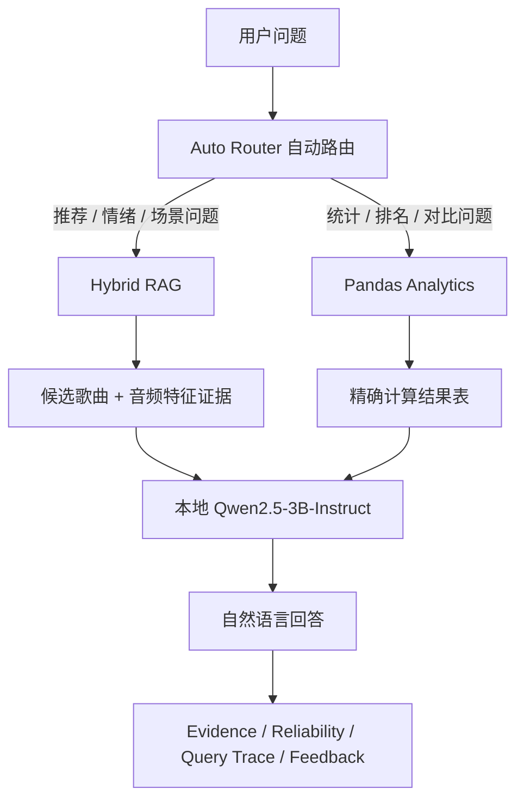

# Taylor Swift Music Intelligence

一个基于本地大模型的 Taylor Swift Spotify 音乐智能分析系统。

本项目将交互式数据报告、AI Music Intelligence Studio、本地 Qwen 推理、Hybrid RAG 推荐、Pandas 精确分析、可解释路由、证据表、可靠性标签、Query Trace 和用户反馈机制整合到一个完整的单服务 Demo 中。

---

## 项目亮点

- 交互式 Taylor Swift Spotify 数据分析报告
- 页面内嵌 AI Music Intelligence Studio
- 本地运行 Qwen2.5-3B-Instruct，无需外部 LLM API
- Hybrid RAG 处理音乐推荐、情绪、场景类问题
- Pandas Analytics 处理统计、排名、对比类问题
- Auto Router 自动判断问题类型并选择处理链路
- 每个回答都提供 Evidence / Result Table
- 每个回答都显示 Reliability Label
- 支持 Query Trace，展示系统如何生成答案
- 支持 Helpful / Not Helpful 用户反馈
- 支持 Recent Questions 查询历史
- 单端口 FastAPI 部署，最终展示更方便

---

## 系统架构



---

## 项目结构

```text
.
├── app/
│   ├── report_assistant_server.py
│   └── report/
│       └── taylor_swift_interactive_report.html
├── src/
│   ├── qwen_local.py
│   ├── rag_hybrid_local.py
│   ├── analytics_local.py
│   ├── router_local.py
│   └── ...
├── data/
│   ├── taylor_swift_spotify_clean.csv
│   └── song_profiles.csv
├── requirements.txt
├── start_demo.sh
└── README.md
```

---

## 核心功能

### 1. AI Music Intelligence Studio

报告页面中内嵌了一个完整的 AI 分析工作台，包括：

- 问题输入框
- 示例问题
- 最近提问历史
- Answer 回答区
- Evidence / Result Table
- Reliability 可靠性标签
- 可展开的 Query Trace
- Feedback Buttons

这不是一个简单的聊天窗口，而是一个面向音乐数据分析的 AI 工作台。

---

### 2. Auto Router 自动路由

系统会先判断用户问题类型，再选择合适的处理链路。

推荐类问题会进入 Hybrid RAG：

```text
从 TTPD 里推荐几首 valence 低、energy 低的歌
推荐几首适合运动的 high energy 歌
Taylor's Version 里有哪些适合安静听的歌？
```

统计类问题会进入 Pandas Analytics：

```text
哪个专辑平均 valence 最低？
哪些歌 popularity 最高？
TTPD 和 folklore 的 acousticness 有什么差异？
```

这样可以避免把所有问题都直接交给大模型，从而减少幻觉，提高结构化数据分析的可靠性。

---

### 3. Hybrid RAG 推荐系统

推荐链路结合了语义意图和结构化音频特征，包括：

- album
- version type
- energy
- valence
- acousticness
- danceability
- popularity
- canonical song name
- version-aware deduplication

系统会先检索和筛选相关歌曲，再让本地 Qwen 基于证据生成解释。

大模型不直接凭记忆回答，而是基于检索到的歌曲证据进行说明。

---

### 4. Pandas Analytics 精确分析

对于统计、排名、对比类问题，系统使用 pandas 直接从本地数据集中计算结果。

支持的问题包括：

- popularity 最高的歌曲
- 平均 valence 最低的专辑
- 不同专辑的 acousticness 对比
- 音频特征排名
- album / era 层面的统计分析
- Taylor's Version 与其他版本的比较

这类问题不依赖大模型猜测，而是由 pandas 精确计算。

---

### 5. 可解释性设计

每个回答都可以展示：

- Detected Intent
- Route Reason
- Processing Pipeline
- Reliability Level
- Query Trace
- Evidence Table 或 Result Table

这让系统不只是“给答案”，还展示“答案是怎么来的”。

---

## 数据集

项目使用 Taylor Swift Spotify 数据集，包含：

- 582 首歌曲
- 19 个专辑版本
- Spotify 音频特征
- popularity 数据
- 专辑与版本信息

主要音频特征包括：

- danceability
- energy
- valence
- acousticness
- tempo
- popularity

---

## 使用模型

本项目使用：

```text
Qwen2.5-3B-Instruct
```

模型在本地运行，不调用外部大模型 API。

注意：模型权重不会上传到 GitHub，需要在本地或服务器上单独下载。

---

## 环境安装

### 1. 克隆仓库

```bash
git clone https://github.com/YOUR_USERNAME/Taylor-Swift-Music-Intelligence.git
cd Taylor-Swift-Music-Intelligence
```

将 `YOUR_USERNAME` 替换为你的 GitHub 用户名。

### 2. 安装依赖

```bash
pip install -r requirements.txt
```

如有缺失，可以额外安装：

```bash
pip install fastapi uvicorn modelscope transformers accelerate
```

---

## 下载本地 Qwen 模型

推荐将模型下载到：

```text
/root/autodl-tmp/models
```

使用 ModelScope 下载：

```bash
mkdir -p /root/autodl-tmp/models

python - <<'PY'
from modelscope import snapshot_download

model_dir = snapshot_download(
    "Qwen/Qwen2.5-3B-Instruct",
    cache_dir="/root/autodl-tmp/models"
)

print("MODEL_DIR=", model_dir)
PY
```

下载完成后，设置模型路径：

```bash
export QWEN_MODEL_DIR=/root/autodl-tmp/models/models/Qwen--Qwen2.5-3B-Instruct/snapshots/master
```

如果实际输出路径不同，请使用 `MODEL_DIR` 打印出来的路径。

---

## 启动 Demo

启动单服务版本：

```bash
bash start_demo.sh
```

也可以直接运行：

```bash
uvicorn app.report_assistant_server:app \
  --host 0.0.0.0 \
  --port 6006
```

然后打开服务器的 6006 外部访问链接。

本项目最终展示只需要一个服务：

```text
交互式报告 + AI Studio + API 后端
```

不需要额外启动单独的 assistant 端口。

---

## 示例问题

### 统计分析类

```text
哪个专辑平均 valence 最低？
哪些歌 popularity 最高？
TTPD 和 folklore 的 acousticness 有什么差异？
```

### 推荐类

```text
从 TTPD 里推荐几首 valence 低、energy 低的歌
推荐几首适合运动的 high energy 歌
Taylor's Version 里有哪些适合安静听的歌？
```

### 版本分析类

```text
推荐几首 deluxe 版本里 valence 低的歌
比较 Taylor's Version 和原版的音频特征
```

---

## API 接口

### 报告页面

```text
GET /
GET /taylor_swift_interactive_report.html
```

### 问答接口

```text
POST /api/ask
```

示例请求：

```json
{
  "question": "哪个专辑平均 valence 最低？",
  "top_k": 5
}
```

### 反馈接口

```text
POST /api/feedback
```

用户反馈会保存在本地：

```text
logs/feedback.jsonl
```

---

## Reliability 设计

系统使用简单的可靠性标签帮助用户理解回答可信度。

| 问题类型 | Reliability |
|---|---|
| pandas 精确统计 | High |
| 带有明确专辑和音频特征约束的推荐 | Medium-High |
| 带有部分结构化约束的推荐 | Medium |
| 模糊语义推荐 | Medium |

---

## 推荐展示流程

最终展示时可以按这个顺序演示：

1. 打开交互式数据报告
2. 展示数据概览和音频特征
3. 点击顶部导航进入 AI Music Intelligence Studio
4. 提问一个统计问题：

```text
哪个专辑平均 valence 最低？
```

5. 展示 pandas Result Table 和 Reliability: High
6. 提问一个推荐问题：

```text
从 TTPD 里推荐几首 valence 低、energy 低的歌
```

7. 展示 Evidence Table、Hybrid RAG、Query Trace
8. 点击 Helpful / Not Helpful 展示反馈记录
9. 展示 System Card 总结系统设计

---

## 技术栈

- Python
- FastAPI
- Uvicorn
- pandas
- scikit-learn
- transformers
- ModelScope
- Qwen2.5-3B-Instruct
- HTML / CSS / JavaScript
- Plotly
- Local GPU Inference

---

## 不上传到 GitHub 的内容

请不要上传本地模型权重和运行日志。

建议忽略：

```text
models/
checkpoints/
*.safetensors
*.bin
*.pt
*.pth
logs/
feedback.jsonl
__pycache__/
*.pyc
```

---

## 项目定位

这个项目不是一个简单的 CSV 聊天机器人。

它将问题理解、自动路由、结构化检索、精确计算、本地大模型生成、证据展示、可靠性标注和用户反馈整合到一个完整的音乐数据智能系统中。

推荐类问题由 Hybrid RAG 处理，统计类问题由 pandas 精确计算，大模型主要负责基于证据进行自然语言解释。

因此，系统的重点不是让大模型“猜答案”，而是让大模型解释已经被检索或计算验证过的结果。
MD
